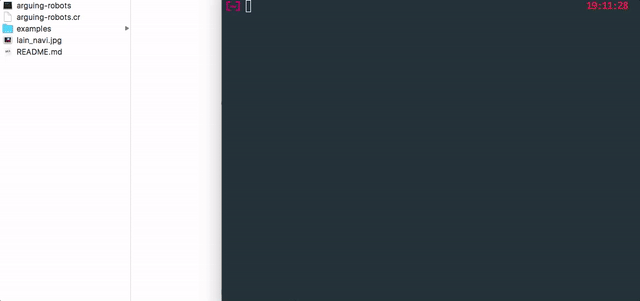

# 🤖 Arguing robots 🤖

Arguing robots is a simple CLI utility for macOS that allow the wonderfully expressive [PlainTalk](https://www.wikiwand.com/en/PlainTalk) voices of macOS (including beloved *whisper* voice of [Lain](https://www.wikiwand.com/en/Serial_Experiments_Lain)'s' Navi) to come to life in your terminal. It also was my Hello World project for learning [Crystal](https://crystal-lang.org/).



## Available voices

Type `say -v '?'` in your terminal to get a list of all available voices

## Usage

1. Download the [CLI](https://github.com/christophemarois/arguing-robots/raw/master/arguing-robots)
2. Make a `.txt` containing dialogue lines in the following format: `[voice]: [text]` , like this one:

```
Alex: Hi, how are you doing?
Karen: I'm good! How about you?
Alex: Good. I've been thinking about this city today.
Victoria: Really? How so?
Karen: Oh, Victoria, you're here!
Victoria: Yes, I arrived two minutes ago.
Karen: So what about this city, Alex?
Alex: It's just...
Alex: How Montreal in the winter inspires people to do art.
```

3. Pass the txt as an argument to the CLI (you can also open a terminal, drag the CLI on it, then drag the txt, then press enter):

```
./arguing-robots montreal-in-the-winter.txt
```

4. Hear and watch robots argue

---

**Whisper:** Who is Lain?

